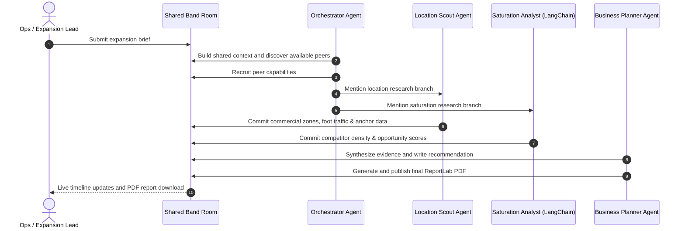

# B Scout 🚀
### Multi-Agent AI Business Scouting & Site Selection Platform

[](https://opensource.org/licenses/MIT)
[](https://flutter.dev)
[](https://fastapi.tiangolo.com)
[](https://www.python.org)

B Scout is an enterprise-grade site selection and market expansion platform designed for retail, franchise, and real-estate operations teams. A user submits a business idea or expansion request (e.g., *"Specialty Coffee chain in Naga City"*), and four specialized AI agents collaborate within a shared execution room to analyze competition, locate real estate targets, calculate opportunity indexes, and package a final investor-ready business plan as a downloadable PDF report.

---

## 🗺️ System Architecture

B Scout divides market research and expansion planning among four Band-connected agents:



---

## 🛠️ Technology Stack & Open-Source Credits

We thank and credit the open-source community and tools that make B Scout possible:

### Frontend (Flutter App)
* **[Flutter](https://flutter.dev/) & [Dart](https://dart.dev/)**: The core framework and programming language enabling cross-platform compilation for Web and Mobile.
* **[flutter_markdown](https://pub.dev/packages/flutter_markdown)**: Renders rich, structured Markdown text reports directly in the user interface.
* **[http](https://pub.dev/packages/http)**: High-level composable HTTP library used to communicate with backend APIs and handle Server-Sent Events (SSE).
* **[open_filex](https://pub.dev/packages/open_filex)**: Provides operating-system-level triggers to view generated PDF reports locally on mobile devices.
* **[path_provider](https://pub.dev/packages/path_provider)**: Safely locates filesystem directories on Android and iOS to cache downloaded reports.
* **[url_launcher](https://pub.dev/packages/url_launcher)**: Enables launching external links and map URLs securely.

### Backend (Python Service)
* **[FastAPI](https://fastapi.tiangolo.com/)**: A modern, high-performance, asynchronous web framework for building APIs with Python.
* **[Uvicorn](https://www.uvicorn.org/)**: A lightning-fast ASGI server implementation for hosting the FastAPI backend.
* **[LangChain (LCEL)](https://www.langchain.com/)**: Powers the structured multi-agent logic inside the Competitor Analyst, facilitating parallel execution and prompt chains.
* **[ReportLab PDF Library](https://www.reportlab.com/)**: Enables server-side generation of complex investor-grade PDFs with custom headers, tables, and branding.
* **[pydantic](https://docs.pydantic.dev/)**: Data validation and settings management using Python type annotations.
* **[python-dotenv](https://github.com/theofidry/django-dotenv)**: Handles environment variable configurations for clean development.

### Integrations & Evidential API Providers
* **[Band Agent SDK](https://app.band.ai/)**: Provides the collaboration protocol, room abstraction layer, WebSocket relays, and identity management.
* **[Mapbox APIs](https://www.mapbox.com/)**: Supplies commercial mapping data, coordinates, and interactive visualization scripts.
* **[Bright Data (Web Unlocker)](https://brightdata.com/)**: Powers robust and structured public-web data scraping for live density analysis.

---

## 🚀 Getting Started

### 1. Running the Backend locally

1. Navigate to the backend directory:
   ```bash
   cd bizideas_backend
   ```
2. Create and activate a Python virtual environment:
   ```bash
   python -m venv venv
   # On Windows:
   venv\Scripts\activate
   # On macOS/Linux:
   source venv/bin/activate
   ```
3. Install dependencies:
   ```bash
   pip install -r requirements.txt
   ```
4. Copy the environment variables template:
   ```bash
   copy .env.example .env   # Windows
   # or
   cp .env.example .env     # macOS/Linux
   ```
5. Configure your API keys in `.env` (Google Gemini, OpenAI, AIMLAPI, etc. See configuration section).
6. Start the API server:
   ```bash
   python main.py
   ```
   The server will run locally at `http://localhost:8000`.

### 2. Running the Flutter Web & Mobile App

1. Ensure you have the Flutter SDK installed.
2. Navigate to the flutter app directory:
   ```bash
   cd bizideas_flutter
   ```
3. Fetch packages:
   ```bash
   flutter pub get
   ```
4. Run the app:
   ```bash
   # Run locally (defaults to http://localhost:8000 fallback for API calls)
   flutter run

   # Run with a custom backend target
   flutter run --dart-define=API_BASE_URL=http://your-server-ip:8000
   ```

---

## ⚙️ Environment Variables Configuration

Create a `.env` file in the `bizideas_backend/` directory with the following options:

| Variable | Description |
|---|---|
| `PORT` | Local server port (default `8000`) |
| `USE_SIMULATOR` | Set to `true` to run B Scout offline using simulated agents (no Band account required). |
| `GEMINI_API_KEY` | Google AI Gemini key for model generations. |
| `AIMLAPI_API_KEY` | AIMLAPI key (DeepSeek, etc.) |
| `FEATHERLESS_API_KEY` | Featherless AI model provider key. |
| `MAPBOX_ACCESS_TOKEN` | Token for geocoding and rendering maps. |
| `BRIGHTDATA_PROXY_HOST` | Bright Data superproxy domain for web scraping. |
| `BRIGHTDATA_PROXY_PORT` | Proxy port. |

---

## 📄 License

B Scout is released under the [MIT License](LICENSE). Feel free to use, modify, and distribute this codebase for your own projects.
